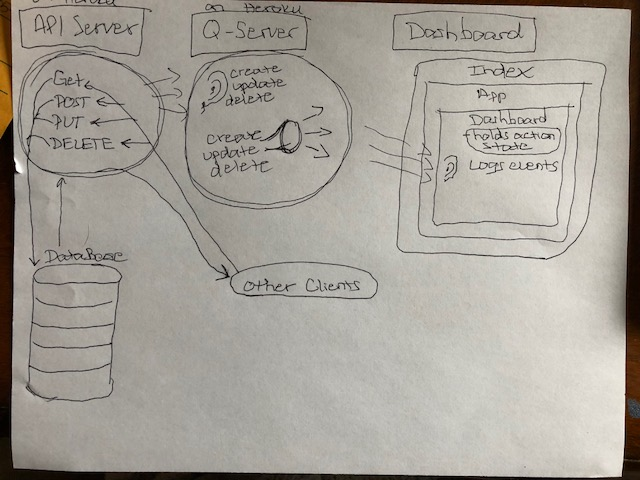

# Dashboard Application

## Available Scripts

In the project directory, you can run:

### `npm start`

Runs the app in the development mode.<br>
Open [http://localhost:3000](http://localhost:3000) to view it in the browser.

The page will reload if you make edits.<br>
You will also see any lint errors in the console.

### `npm test`

Launches the test runner in the interactive watch mode.<br>
Asserting that create, update, and delete are being heard and changing the state to log the event to the page

### `npm run build`

Builds the app for production to the `build` folder.<br>
It correctly bundles React in production mode and optimizes the build for the best performance.

The build is minified and the filenames include the hashes.<br>

## Running the APP
* There are two backend servers which serve this app (see the UML for more details) and one front end application. 

### The API Server
* This server is running on Heroku at the following address: 
https://eivy-lab-13-pretty.herokuapp.com/api/v1/products <br>
https://eivy-lab-13-pretty.herokuapp.com/api/v1/categories <br>
* This server holds the models for the Mongo DB and fetches the information requested

### The Q Server
* This server is also running on Heroku at hte following address:
https://eivy-q-server.herokuapp.com/ <br>
* This is the 'middle-man' server that is listening for events and broadcasting when events occur. This is the server that is allowing the API server and the front end React App to communicate. The connective tissue, of this applicaiton, if you will.

### The Front End - Dashboard
* The front end is a React App that is running on http://localahost:3000
* you can launch the front end by entering the following command in your terminal: `npm start`

### Connecting and Running the APP
* The purpose of this app is to provide a way for the front end to monitor events that are occuring in the backend database. Every time a 'CREATE', 'UPDATE', or 'DELETE' is requested on the backend, that event gets logged on our Dashboard React App along with the id of the record. 

* To run the app, do the following things:
1. make sure your Dashboard App is up and running by entering `npm start`
2. **ADD A RECORD** to the backend database by running the following command from your terminal:
```curl -H "Content-Type: application/json" -d '{"name":"cats"}' https://eivy-lab-13-pretty.herokuapp.com/api/v1/products```
* This will add a record to your products and you will see in your dashboard that a record was added
* This will also returnn the record to your terminal so copy the ID because we will use it in the next step
3. **UPDATE A RECORD** by running the following command and replacing {ID} with the ID that you coppied in the previous step
```curl -X PUT -H "Content-Type: application/json" -d '{"name":"catedit","id":"{ID"}' https://eivy-lab-13-pretty.herokuapp.com/api/v1/{ID}```
4. **DELETE A RECORD** by running the following command and replacing {ID} with the ID that you copied
```curl -X DELETE  https://eivy-lab-13-pretty.herokuapp.com/api/v1/products/{ID}```

## UML
